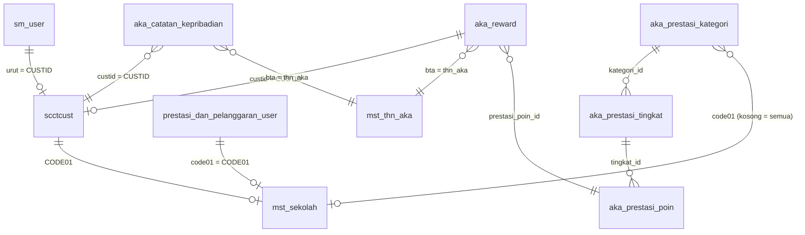

# API WS Mualimat Reward

Dokumentasi folder `ws/` berdasarkan kode yang ditarik dari server.

- **Endpoint produksi:** `http://103.23.103.43/ws_client/mualimat_reward/index.php`
- **Entry point:** `ws/index.php`
- **Database:** MySQL `yogya_muallimaat` (lihat `ws/.env`, jangan commit secret)
- **Terakhir diselaraskan:** 25 Agustus 2026

Setiap kali folder `ws/` di-update dari server, **file ini wajib diperbarui** (method, tabel, kolom, validasi, env).

---

## Ringkasan

API PHP JSON (POST). Semua aksi memakai field `method`. Laravel di project ini memanggil URL di `WS_URL`, bukan menjalankan folder ini langsung (kecuali `WS_URL` kosong).

| Method | Auth | Fungsi |
|---|---|---|
| `login` | tidak | Login siswa (`sm_user` + `scctcust`) |
| `loginApproval` | tidak | Login Musrifah / superadmin |
| `getTahunAkademik` | tidak | Daftar tahun akademik |
| `getPrestasiKatalog` | tidak | Master jenis → tingkat → poin |
| `submitPrestasi` | JWT siswa | Simpan prestasi + tautan Google Drive |
| `approval` | JWT staf | List / approve / tolak |
| `manageUsers` | JWT superadmin | CRUD Musrifah & superadmin |
| `manageKatalog` | JWT superadmin | CRUD kategori, tingkat, dan poin |
| `searchSiswa` | JWT staf | Cari siswi (`scctcust`) untuk catatan kepribadian |
| `manageCatatanKepribadian` | JWT staf | CRUD catatan kepribadian siswi |

---

## Struktur folder

```
ws/
├── index.php              # API utama
├── index2.php             # varian/uji (bukan kontrak utama)
├── payload.php            # util JWT
├── Validator.php          # validator generik
├── info.php
├── .env                   # konfigurasi runtime (secret, jangan commit)
├── error.log
├── config/
│   ├── conn.php           # PDO MySQL
│   ├── DbClass.php
│   └── jwt.php            # JWT HS256 (class JWT)
├── src/jwt/               # library Firebase JWT (cadangan)
├── sql/                   # query Navicat (katalog prestasi)
└── public/uploads/        # file bukti (legacy)
```

Loader `index.php` memakai `lib/` jika ada, jika tidak memakai `config/` (`DbClass.php`, `conn.php`, `jwt.php`).

---

## Environment (`ws/.env`)

| Variabel | Wajib | Keterangan |
|---|---|---|
| `DB_HOST` | ya | Host MySQL |
| `DB_PORT` | tidak | Default `3306` |
| `DB_DATABASE` | ya | Nama database |
| `DB_USERNAME` | ya | User DB |
| `DB_PASSWORD` | tidak | Password DB |
| `JWT_KEY` | ya | Kunci HMAC HS256 |
| `CORS_ORIGIN` | tidak | Default `*` |
| `PUBLIC_BASE_URL` | tidak | Prefix URL file publik |
| `LARAVEL_APP_URL` | tidak | Host yang diizinkan untuk field `url` |
| `UPLOAD_ABS_PATH` | tidak | Default `ws/public/uploads` |
| `UPLOAD_URL_PREFIX` | tidak | Default `/uploads` |

Jangan menuliskan nilai secret di README.

---

## Relasi tabel



---

## Tabel dan kolom (yang dipakai API)

Tipe di bawah adalah **inferensi dari pemakaian SQL**, bukan dump `SHOW CREATE TABLE`. Kolom lain mungkin ada di database tapi tidak disentuh API ini.

### 1. `sm_user`

Akun login siswa (`method=login`).

| Kolom | Dipakai sebagai | Keterangan |
|---|---|---|
| `userlogin` | username | `TRIM(userlogin)` dicocokkan ke input |
| `kunci` | password | `password_hash` / SHA1 / SHA256 / MD5 / plaintext |
| `urut` | join ke profil | `scctcust.CUSTID = sm_user.urut` |

**Join:** `LEFT JOIN scctcust c ON c.CUSTID = u.urut`

Jika baris `sm_user` ada tapi `scctcust` tidak ketemu: **403** “Data akun tidak lengkap”.

---

### 2. `prestasi_dan_pelanggaran_user`

Akun login staf (`method=loginApproval`) dan kelola admin (`manageUsers`). Bukan sumber login siswa.

| Kolom | Dipakai sebagai | Keterangan |
|---|---|---|
| `idincrement` | PK, `userid` | ID numerik akun |
| `username` | login staf | Unik, 1–50, pola `[a-zA-Z0-9._@-]+` |
| `password` | login staf | `password_hash` / SHA1 / SHA256 / MD5 / plaintext |
| `nama` | label akun | Maks. 50 saat create/update admin |
| `role` | otorisasi | `Musrifah`, `superadmin` (akun `siswa` di tabel ini tidak dipakai `login`) |
| `code01` | sekolah user | FK ke `mst_sekolah.CODE01`, wajib untuk Musrifah (maks. 20) |

**Join:** `LEFT JOIN mst_sekolah ms ON ms.CODE01 = u.code01`

**Role:**

| Nilai di DB | Login siswa (`login`) | Login staf (`loginApproval`) | Approval | Kelola admin |
|---|---|---|---|---|
| `sm_user` + `scctcust` | ya | tidak | tidak | tidak |
| selain Musrifah/superadmin di tabel staf | tidak | 403 | tidak | tidak |
| `Musrifah` | tidak | ya | ya, hanya sekolah `code01` | tidak |
| `superadmin` | tidak | ya | ya, semua sekolah | ya |

---

### 3. `mst_sekolah`

Master sekolah / unit (filter approval staf).

| Kolom | Dipakai sebagai | Keterangan |
|---|---|---|
| `CODE01` | PK kode sekolah | Dipakai user staf, customer, filter approval |
| `DESC01` | nama sekolah | Tampil sebagai `nama_sekolah` / `sekolah` di login staf |

---

### 4. `mst_thn_aka`

Master tahun akademik.

| Kolom | Dipakai sebagai | Keterangan |
|---|---|---|
| `thn_aka` | tahun, format `YYYY/YYYY` | Tahun akhir = tahun awal + 1 |
| `urut` | urutan list | `ORDER BY urut ASC` |

Submit prestasi menolak `bta` yang tidak ada di tabel ini.

---

### 5. `aka_reward`

Data prestasi yang diinput.

| Kolom | Dipakai sebagai | Keterangan |
|---|---|---|
| `id` | PK | Diisi manual `MAX(id)+1` jika autoincrement tidak jalan |
| `custid` | ID siswa | Dari JWT `custid` (`scctcust.CUSTID` = `sm_user.urut`) |
| `nocust` | nomor siswa | Dari JWT (`scctcust.NOCUST`, fallback `userlogin`). Folder upload = `uploads/{nocust}/` |
| `nisn` | NISN siswa | 10 digit, diisi form submit |
| `nmcust` | nama | Dari JWT (`scctcust.NMCUST`) |
| `kelas` | kelas | Dari JWT `kelas` (`scctcust.DESC02`) |
| `jenis_prestasi` | label gabungan | `kategori — tingkat — capaian` (disusun server) |
| `prestasi_kategori_id` | FK kategori | `aka_prestasi_kategori.id` |
| `prestasi_tingkat_id` | FK tingkat | `aka_prestasi_tingkat.id` |
| `prestasi_poin_id` | FK poin | `aka_prestasi_poin.id` |
| `keterangan` | deskripsi | Teks, maks. 500, tanpa HTML |
| `penyelenggara` | lembaga | Teks, maks. 150 |
| `no_sertifikat` | nomor sertifikat | Teks, maks. 80 |
| `nilai_penghargaan` | nilai | Disalin dari `aka_prestasi_poin.nilai` saat submit (bukan dari klien) |
| `bta` | tahun akademik | Sama dengan `tahun_akademik` / `mst_thn_aka.thn_aka` |
| `semester` | semester | `1` atau `2` |
| `url` | bukti | Tautan Google Drive (`drive.google.com` / `docs.google.com`) |
| `isapproved` | status | ENUM `pending` / `approve` / `canceled` (bukan 0/1/NULL). Default insert = `pending`. Migrasi: `ws/sql/aka_reward_approval_status.sql` |
| `approveddate` | waktu aksi | `NOW()` saat setujui atau tolak |
| `approvedby` | username petugas | Dari JWT staf `username` |
| `catatan_admin` | alasan tolak | Wajib saat `tolak`, dikosongkan saat `approve`. Migrasi: `ws/sql/aka_reward_catatan_admin.sql` |
| `created_at` | waktu input | `NOW()` |
| `updated_at` | waktu ubah | `NOW()` |

**Join approval:**

```sql
aka_reward ar
LEFT JOIN scctcust sc ON sc.CUSTID = ar.custid
LEFT JOIN mst_sekolah ms ON ms.CODE01 = sc.CODE01
```

Musrifah hanya melihat baris yang `sc.CODE01` = `code01` di token. Superadmin tanpa filter sekolah.

Limit list: **1000** baris terbaru.

---

### 6. `aka_prestasi_kategori`

Master jenis prestasi (A–F).

| Kolom | Dipakai sebagai | Keterangan |
|---|---|---|
| `id` | PK | Dipilih di form, lalu disimpan ke `aka_reward` |
| `kode` | A–F | Kode kategori; unik bersama `code01` |
| `nama` | label combo | Contoh: Prestasi Lomba Non Akademik |
| `urut` | urutan combo | |
| `code01` | unit | `mst_sekolah.CODE01`. Kosong = semua unit. Terisi = kategori beserta tingkat dan poinnya hanya untuk unit itu. Poin beda per unit: buat baris kategori terpisah (kode boleh sama). |

### 7. `aka_prestasi_tingkat`

Tingkat / rincian per kategori (Organtri, Madrasah, … atau item keagamaan).

| Kolom | Dipakai sebagai | Keterangan |
|---|---|---|
| `id` | PK | |
| `kategori_id` | FK | `aka_prestasi_kategori.id` |
| `nama` | label combo ke-2 | |
| `urut` | urutan | |

### 8. `aka_prestasi_poin`

Capaian (Juara 1/2/3, Harapan, Peserta, Peringkat, dll.) plus nilai. **Nilai awal 0**; admin yang mengisi.

| Kolom | Dipakai sebagai | Keterangan |
|---|---|---|
| `id` | PK | |
| `tingkat_id` | FK | `aka_prestasi_tingkat.id` |
| `nama` | label combo ke-3 | |
| `nilai` | poin | `DECIMAL`, default `0.00` |
| `urut` | urutan | |

Query seed: `ws/sql/rombak_prestasi_katalog.sql`.
Kolom `aka_reward`: `ws/sql/alter_aka_reward_kolom_prestasi.sql` (jalankan per baris; abaikan Duplicate column).
Status `aka_reward.isapproved`: `ws/sql/aka_reward_approval_status.sql`.
Kolom `aka_reward.catatan_admin`: `ws/sql/aka_reward_catatan_admin.sql` (abaikan Duplicate column).
Kolom `aka_prestasi_kategori.code01`: `ws/sql/aka_prestasi_unit.sql` (abaikan Duplicate column jika sudah ada).

---

### 9. `scctcust`

Profil siswa di sistem akademik. Dipakai login siswa dan filter sekolah pada approval.

| Kolom | Dipakai sebagai | Keterangan |
|---|---|---|
| `CUSTID` | `custid`, join `sm_user.urut` dan `aka_reward.custid` | Harus ada agar login siswa sukses |
| `NOCUST` | `nocust` | Nomor siswa; fallback `sm_user.userlogin` |
| `NMCUST` | `nmcust` | Nama |
| `CODE01` | kode sekolah | FK ke `mst_sekolah.CODE01` (filter Musrifah) |
| `CODE02` | `unit` | Identitas / unit, contoh MA, MTs |
| `DESC02` | `kelas` | Kelas, contoh IX A, ICT |

Jika `custid` di `aka_reward` tidak ketemu di `scctcust`, baris itu tidak lolos filter Musrifah (`CODE01` NULL).

---

### 10. `aka_catatan_kepribadian`

Catatan kepribadian siswi. Diisi Musrifah / superadmin. Identitas siswi diambil dari `scctcust` (NIS, nama, kelas). Jenis pelanggaran, bentuk pembinaan, dan skor diisi manual.

| Kolom | Dipakai sebagai | Keterangan |
|---|---|---|
| `id` | PK | AUTO_INCREMENT |
| `custid` | FK siswi | `scctcust.CUSTID` |
| `nocust` | NIS | `scctcust.NOCUST` |
| `nmcust` | nama | Salinan saat simpan |
| `kelas` | kelas | `scctcust.DESC02` |
| `code01` | unit | Filter Musrifah |
| `bta` | tahun ajaran | `mst_thn_aka.thn_aka` |
| `semester` | semester | `1` ganjil, `2` genap |
| `jenis_pelanggaran` | teks | Input manual, maks. 500 |
| `bentuk_pembinaan` | teks | Input manual, maks. 500 |
| `skor` | nilai | `DECIMAL`, input manual |
| `created_by` / `updated_by` | username petugas | |

Query: `ws/sql/aka_catatan_kepribadian.sql`. WS juga membuat tabel jika belum ada.

---

## Bukti prestasi

Submit siswa memakai tautan **Google Drive** (bukan unggah file):

- skema `https`
- host: `drive.google.com`, `docs.google.com`, atau `drive.usercontent.google.com`
- maks. 500 karakter

Kode unggah file lama (`saveUploadedFile`) masih ada di `index.php` tapi tidak dipakai `submitPrestasi` saat ini.

---

## Autentikasi JWT

- Algoritma: **HS256**
- Masa berlaku: **12 jam**
- Kirim token: field `token` atau header `Authorization: Bearer {jwt}`

### Payload `login` (siswa)

```json
{
  "custid": "...",
  "nocust": "...",
  "nmcust": "...",
  "unit": "...",
  "kelas": "...",
  "code01": "...",
  "iat": 0,
  "exp": 0
}
```

### Payload `loginApproval` (staf)

```json
{
  "userid": "...",
  "username": "...",
  "nama": "...",
  "role": "...",
  "code01": "...",
  "iat": 0,
  "exp": 0
}
```

`submitPrestasi` membutuhkan payload siswa (`custid` + `nocust`). Token staf tidak bisa dipakai submit.

---

## Kontrak method

Format umum sukses:

```json
{ "status": 200, "data": { } }
```

Format error:

```json
{ "status": 401, "message": "..." }
```

Body: `application/json` atau `application/x-www-form-urlencoded` / multipart (`$_POST`).

### `login`

| Field | Wajib | Aturan |
|---|---|---|
| `method` | ya | `login` |
| `username` | ya | 1–50, `[a-zA-Z0-9._@-]+` |
| `password` | ya | 1–128, tanpa control char |

`data`: `token`, `custid`, `nocust`, `nmcust`, `unit`, `kelas`

`custid` = `scctcust.CUSTID` (`sm_user.urut`). `unit` = `CODE02`. `kelas` = `DESC02`.

### `loginApproval`

Field sama seperti login, `method=loginApproval`.

`data`: `token`, `userid`, `username`, `nama`, `role`, `code01`

### `getTahunAkademik`

Hanya `method`. `data.tahun_akademik`: array string `YYYY/YYYY`.

### `getPrestasiKatalog`

`method` wajib. Kirim `token` siswa (opsional tapi disarankan) agar daftar disaring ke `scctcust.CODE01` unit siswa. Tanpa token, seluruh katalog dikembalikan (nilai default).

`data`: `kategori`, `tingkat`, `poin`. `kategori` punya `code01` (kosong = semua unit). Tingkat dan poin mengikuti kategori induk: jika `code01` terisi, seluruh pohon itu hanya untuk unit tersebut. Dengan token siswa, daftar disaring ke kategori kosong atau `code01` = unit siswa.

### `submitPrestasi`

| Field | Wajib | Aturan |
|---|---|---|
| `token` | ya | JWT siswa |
| `nisn` | ya | 10 digit angka |
| `tahun_akademik` atau `bta` | ya | ada di `mst_thn_aka` |
| `semester` | ya | `1` atau `2` |
| `prestasi_kategori_id` | ya | ada di master, selaras tingkat & poin |
| `prestasi_tingkat_id` | ya | milik kategori terpilih |
| `prestasi_poin_id` | ya | milik tingkat terpilih |
| `keterangan` | ya | maks. 500 |
| `penyelenggara` | ya | maks. 150 |
| `no_sertifikat` | ya | maks. 80 |
| `url` | ya | tautan Google Drive |

`nilai_penghargaan` dan `jenis_prestasi` disusun server dari master poin. `data`: `id`, `url`

### `approval`

Butuh JWT staf. `action`: `list` (default), `approve`, `tolak`.

**list** (filter opsional):

| Field | Keterangan |
|---|---|
| `isapproved` | `pending`, `approve`, atau `canceled` (kosong = semua) |
| `q` | cari `nocust` / `nmcust` |
| `tanggal_dari` / `tanggal_sampai` | `YYYY-MM-DD` |
| `tanggal` | legacy, mengisi dari & sampai |

**approve / tolak:** `id` (PK `aka_reward`).

Setujui menyimpan `isapproved=approve`, `approvedby` = username petugas, dan mengosongkan `catatan_admin`. Tolak wajib `catatan_admin` (3–500 karakter), menyimpan `isapproved=canceled` dan `approvedby` = username petugas.

### `manageUsers`

Butuh JWT `superadmin`. `action`: `list`, `create`, `update`, `delete`.

**create:** `username`, `password` (min. 4), `nama`, `role` (`Musrifah`/`superadmin`), `code01` (wajib Musrifah).

**update:** `id` + field create; `password` opsional.

**delete:** `id` (tidak boleh hapus diri sendiri). Akun `siswa` tidak dikelola di sini.

### `manageKatalog`

Butuh JWT `superadmin`. Mengatur master `aka_prestasi_kategori` → `aka_prestasi_tingkat` → `aka_prestasi_poin`.

| Field | Keterangan |
|---|---|
| `action` | `list`, `create`, `update`, `delete` |
| `entity` | wajib selain `list`: `kategori`, `tingkat`, `poin` |

**list:** `data.kategori` (termasuk `code01`), `data.tingkat`, `data.poin`, plus `sekolah`.

**kategori create/update:** `kode` (A–Z / 0–9, 1–10), `nama` (maks. 120), `urut` opsional, `code01` (opsional; kosong = semua unit). Unik pada pasangan `(kode, code01)`.

**tingkat create/update:** `kategori_id`, `nama`, `urut` opsional. Tidak ada field unit; ikut kategori induk.

**poin create/update:** `tingkat_id`, `nama`, `nilai` (default `0.00`), `urut` opsional. Tidak ada override poin per unit; jika poin berbeda, buat kategori terpisah dengan `code01` unit itu.

**delete:** `id`. Menolak jika masih dipakai `aka_reward`, atau jika masih ada anak (tingkat di kategori / capaian di tingkat).

Poin pada data prestasi yang sudah masuk tidak diubah otomatis saat nilai master diedit.

### `searchSiswa`

Butuh JWT staf. Field `q` (min. 2 karakter). `data.items`: `custid`, `nocust`, `nmcust`, `kelas`, `code01`, `sekolah`. Musrifah hanya melihat siswi unitnya.

### `manageCatatanKepribadian`

Butuh JWT staf. `action`: `list`, `get`, `create`, `update`, `delete`.

**create/update:** `nis`, `tahun_akademik` (`YYYY/YYYY`), `semester` (`1`/`2`), `jenis_pelanggaran`, `bentuk_pembinaan`, `skor`. Update plus `id`. Identitas nama/kelas diambil dari `scctcust` berdasarkan NIS.

**get / delete:** `id`.

---

## Kode HTTP yang dipakai

| Status | Arti khas |
|---|---|
| 200 | Sukses |
| 401 | Login salah / token hilang / JWT invalid / sesi submit invalid |
| 403 | Role tidak boleh / data akun tidak lengkap (login siswa) |
| 404 | Admin / data approval tidak ketemu |
| 422 | Validasi input / method tidak dikenal |
| 500 | Konfigurasi kurang (`.env` / lib) atau error sistem |
| 503 | Gagal koneksi database |

---

## Catatan integrasi Laravel

- Frontend siswa memakai `login`, `getTahunAkademik`, `getPrestasiKatalog`, `submitPrestasi`.
- `loginApproval`, `approval`, `manageUsers`, `manageKatalog` dipakai aplikasi Approval Prestasi (Laravel).
- `loginApproval`, `searchSiswa`, `manageCatatanKepribadian` dipakai aplikasi Catatan Kepribadian Siswi (Laravel).
- Proxy siswa: `POST /api/reward` → `WS_URL`.
- Tahun akademik dan katalog prestasi di-cache Laravel (default 6 jam).

---

## Checklist update README (saat `ws/` diganti)

1. Method baru / berubah di `SECURE_INPUT_ALLOWED_METHODS`
2. Tabel atau kolom baru di SQL
3. Perubahan role, JWT payload, atau validasi
4. Env baru
5. Perubahan path upload atau aturan file
6. Tanggal “Terakhir diselaraskan” di atas
